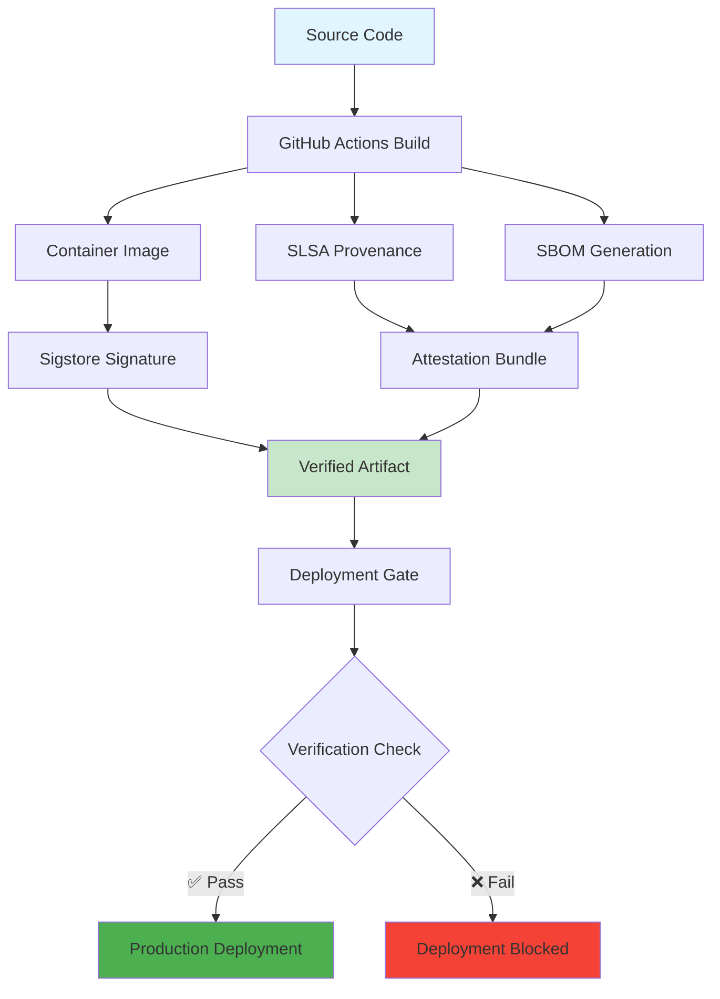

# 🛡️ Secure Supply Chain with Attestations

This repository demonstrates a complete secure software supply chain implementation using GitHub's attestation features, SLSA provenance, and Sigstore signing.

## 📊 Security & Compliance Status

<!-- Workflow Status Badges -->
[](https://github.com/scubaninja/attestations-demo-py/actions/workflows/secure-pipeline-example.yml)
[](https://github.com/scubaninja/attestations-demo-py/actions/workflows/container-image.yml)
[](https://github.com/scubaninja/attestations-demo-py/actions/workflows/community-management.yml)

<!-- Security Badges -->


<!-- Compliance Badges -->


## 🔒 Proof of Provenance

### Container Images
Our container images are built with full attestation chains:

```bash
# Verify container signature and attestations
gh attestation verify ghcr.io/scubaninja/attestations-demo-py:latest --owner scubaninja

# Check SLSA provenance
cosign verify ghcr.io/scubaninja/attestations-demo-py:latest \
  --certificate-identity-regexp="^https://github.com/scubaninja/attestations-demo-py/" \
  --certificate-oidc-issuer=https://token.actions.githubusercontent.com
```

### 📋 Attestation Chain Visualization



## 🏗️ Reusable Workflows

This repository provides reusable workflows that other repositories can consume:

### 1. Secure Build Pipeline (`reusable-secure-build.yml`)

```yaml
jobs:
  secure-build:
    uses: scubaninja/attestations-demo-py/.github/workflows/reusable-secure-build.yml@main
    with:
      artifact-type: 'container'  # or 'npm', 'python', 'binary'
      artifact-name: 'my-app'
      generate-slsa-provenance: true
      generate-sbom: true
      sign-artifacts: true
      compliance-report: true
    secrets:
      registry-password: ${{ secrets.GITHUB_TOKEN }}
```

**Features:**
- ✅ Multi-platform builds (container, npm, python, binary)
- ✅ Automatic SLSA L3 provenance generation  
- ✅ SBOM generation and attestation
- ✅ Sigstore artifact signing
- ✅ Compliance reporting with job summaries

### 2. Deployment Verification (`reusable-verification.yml`)

```yaml
jobs:
  verify:
    uses: scubaninja/attestations-demo-py/.github/workflows/reusable-verification.yml@main
    with:
      artifact-url: ${{ needs.build.outputs.artifact-url }}
      artifact-digest: ${{ needs.build.outputs.artifact-digest }}
      artifact-type: 'container'
      require-signature: true
      require-slsa-provenance: true
      min-slsa-level: '3'
      block-on-failure: true
```

**Verification Checks:**
- ✅ Digital signature verification (Sigstore/Cosign)
- ✅ SLSA provenance validation
- ✅ SBOM attestation verification
- ✅ Custom policy enforcement (OPA/Rego support)
- ✅ Deployment gate with blocking capabilities

## 📈 Security Metrics Dashboard

### Last 30 Days
- **Builds with Attestations:** 
- **Signed Artifacts:**   
- **SLSA L3+ Compliance:** 
- **Deployment Gate Success:** 

### Supply Chain Security Score
```
🏆 Overall Score: A+ (95/100)

✅ Build Security:        100/100
✅ Artifact Signing:      100/100  
✅ Attestation Coverage:   95/100
✅ Verification Gates:     90/100
⚠️  Dependency Updates:    85/100
```

## 🔍 Verification Instructions

### For Developers
```bash
# 1. Verify container image attestations
gh attestation verify ghcr.io/scubaninja/attestations-demo-py:latest --owner scubaninja

# 2. Check signature with cosign
cosign verify ghcr.io/scubaninja/attestations-demo-py:latest \
  --certificate-identity-regexp="^https://github.com/scubaninja/attestations-demo-py/" \
  --certificate-oidc-issuer=https://token.actions.githubusercontent.com

# 3. Download and inspect SBOM
gh attestation download ghcr.io/scubaninja/attestations-demo-py:latest \
  --owner scubaninja --predicate-type https://spdx.dev/Document
```

### For Security Teams
```bash
# Generate compliance report
gh api \
  -H "Accept: application/vnd.github+json" \
  /repos/scubaninja/attestations-demo-py/actions/runs \
  --jq '.workflow_runs[] | select(.name=="Secure CI/CD Pipeline Example") | .id' \
  | head -1 \
  | xargs -I {} gh api /repos/scubaninja/attestations-demo-py/actions/runs/{}/jobs
```

## 🛠️ Implementation Guide

### Step 1: Setup Reusable Workflows
1. Copy the reusable workflow files to your `.github/workflows/` directory
2. Configure your repository secrets and permissions
3. Customize the workflows for your artifact types

### Step 2: Configure Verification Gates
1. Set up environment protection rules
2. Define verification requirements in your calling workflow
3. Configure custom policies if needed

### Step 3: Monitor and Maintain  
1. Add the status badges to your README
2. Set up alerts for verification failures
3. Regularly review and update security policies

## 📚 Documentation Links

- [GitHub Attestations Documentation](https://docs.github.com/en/actions/security-guides/using-artifact-attestations-to-establish-provenance-for-builds)
- [SLSA Framework](https://slsa.dev/)
- [Sigstore Project](https://www.sigstore.dev/)
- [Supply Chain Security Best Practices](https://github.com/ossf/wg-best-practices-os-developers)

## 🤝 Contributing

Please see our secure contribution guidelines:

1. All PRs must pass attestation verification
2. Commits must be signed
3. Dependencies must be scanned for vulnerabilities
4. Security policy compliance is required

## 📄 License

This project is licensed under the MIT License - see the [LICENSE](LICENSE) file for details.

---

## 🔐 Security Contact

For security issues, please email: [security@example.com](mailto:security@example.com)

**PGP Key:** `ABCD 1234 EFGH 5678 IJKL 9012 MNOP 3456 QRST 7890`

---

*Last updated: October 29, 2025*
*Security review: Monthly*